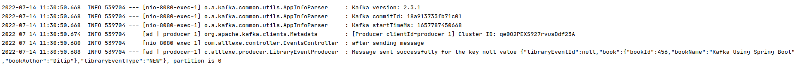
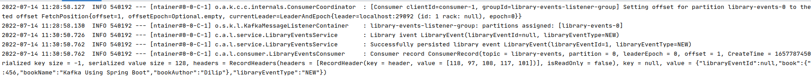

# kafka-for-developers-using-spring-boot

This repository has the complete code related to kafka producers/consumers using spring boot.

- [Setup-Kafka](https://github.com/a11exe/kafka-springboot/blob/master/SetUpKafka.md)
- or [run kafka in docker](https://www.baeldung.com/ops/kafka-docker-setup) using the docker-compose command:
```
docker-compose up -d
```

## Run producer application
```
./library-events-producer/gradlew -p ./library-events-producer/ bootRun
```

## Run consumer application
```
./library-events-consumer/gradlew -p ./library-events-consumer/ bootRun
```

## Send  message
[list message commands](/library-events-producer/curl-commands.txt)
```
curl -i \
-d '{"libraryEventId":null,"book":{"bookId":456,"bookName":"Kafka Using Spring Boot","bookAuthor":"Dilip"}}' \
-H "Content-Type: application/json" \
-X POST http://localhost:8080/v1/libraryevent
```

## Check message in consumer
```
Consumer record ConsumerRecord(topic = library-events, partition = 0, leaderEpoch = 0, offset = 1, CreateTime = 1657787450677, serialized key size = -1, serialized value size = 128, headers = RecordHeaders(headers = [RecordHeader(key = header, value = [118, 97, 108, 117, 101])], isReadOnly = false), key = null, value = {"libraryEventId":null,"book":{"bookId":456,"bookName":"Kafka Using Spring Boot","bookAuthor":"Dilip"},"libraryEventType":"NEW"})
```


## Securing your Kafka Cluster using SSL

- [Kafka SSL SetUp](https://github.com/a11exe/kafka-springboot/blob/master/Kafka_Security.md)

## H2 Database

- Access the h2 database in the following link - http://localhost:8081/h2-console